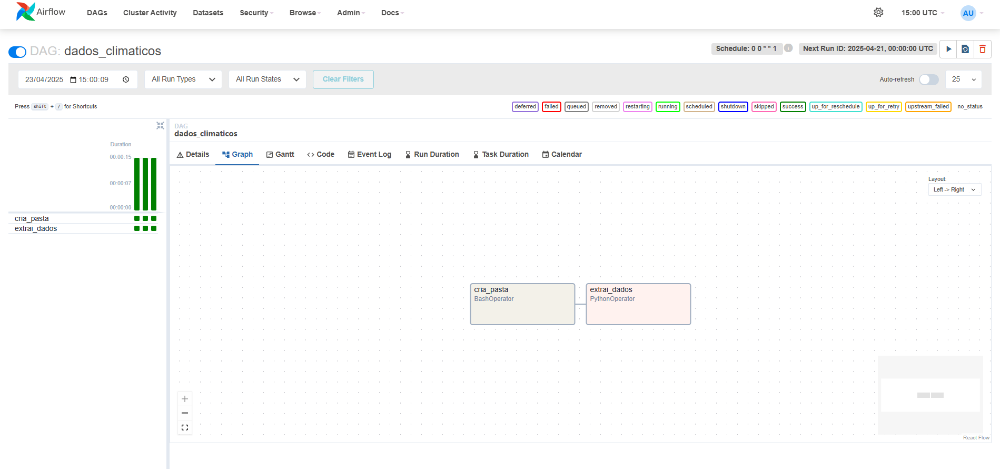

# 🌤️ Weather Data Pipeline with Apache Airflow

This project implements a weather data pipeline using Apache Airflow. The pipeline automates the extraction, transformation, and storage of weather data for the city of Boston, MA, on a weekly basis.

## ✨ Features

- **📥 Data Extraction**: Fetches weather data from the Visual Crossing Weather API for a 7-day period starting from the specified date.
- **🔄 Data Transformation**: Processes the raw data into three separate CSV files:
    - `📄 dados_brutos.csv`: Contains the raw weather data.
    - `📄 temperaturas.csv`: Includes minimum, current, and maximum temperatures for each day.
    - `📄 condicoes.csv`: Contains weather descriptions and icons for each day.
- **💾 Data Storage**: Saves the processed files into a directory named after the week (`semana=YYYY-MM-DD`).

## 📂 Project Structure

- **🗂️ DAGs**:
    - `📜 dados_climaticos.py`: Defines the Airflow DAG for the weather data pipeline.
    - `📜 atividade_aula_4_dag.py` and `📜 meu_primeiro_dag.py`: Example DAGs for learning purposes.
- **📁 Data Directories**:
    - `📂 dags/semana=YYYY-MM-DD/`: Stores the generated CSV files for each week.
- **⚙️ Configuration**:
    - `⚙️ airflow.cfg`: Airflow configuration file.
    - `⚙️ webserver_config.py`: Webserver configuration for Airflow.

## 🛠️ How It Works

1. **📂 Folder Creation**: The pipeline creates a directory for the current week's data.
2. **🌐 Data Fetching**: Weather data is fetched from the API using the `PythonOperator`.
3. **🧹 Data Processing**: The raw data is split into three CSV files for easier analysis.
4. **⏰ Scheduling**: The DAG runs every Monday at midnight (`0 0 * * 1`).

## 📋 Requirements

- **🐍 Python Libraries**:
    - `pandas`
    - `pendulum`
    - `apache-airflow`
- **🔑 API Key**: A valid API key for the Visual Crossing Weather API.

## 🚀 Usage

1. Clone the repository and set up an Airflow environment.
2. Place your API key in the `extrai_dados` function in `dados_climaticos.py`.
3. Start the Airflow scheduler and webserver.
4. Trigger the `dados_climaticos` DAG manually or let it run on schedule.

## 📊 Example Output

The pipeline generates the following files for each week:

- `📄 dados_brutos.csv`: Raw weather data.
- `📄 temperaturas.csv`: Daily temperature statistics.
- `📄 condicoes.csv`: Weather conditions and descriptions.

## 🏃 How to Run

Follow the steps below to run the project locally with Apache Airflow:

### 1. 🖥️ Clone the repository

```bash
git clone https://github.com/vitorlinsbinski/airflow-dados-climaticos.git
cd airflow-dados-climaticos
```

### 2. 🐍 Create and activate a virtual environment 
```bash
python -m venv venv
source venv/bin/activate  # Linux/macOS
```

### 3. 📦 Install dependencies
```bash
pip install pandas pendulum
pip install "apache-airflow==2.10.5" --constraint "https://raw.githubusercontent.com/apache/airflow/constraints-2.10.5/constraints-3.9.txt"
```

### 4. 🌍 Set the AIRFLOW_HOME environment variable
```bash
export AIRFLOW_HOME=$(pwd)  # Linux/macOS
```

### 5. 🔑 Insert your API Key
Open the file `dados_climaticos.py` and replace the placeholder with your Visual Crossing API key:
```py
key = 'YOUR-API-KEY'
```

### 6. ⚙️ Initialize Airflow
```bash
airflow standalone
```

### 7. Data Pipeline Screenshot
